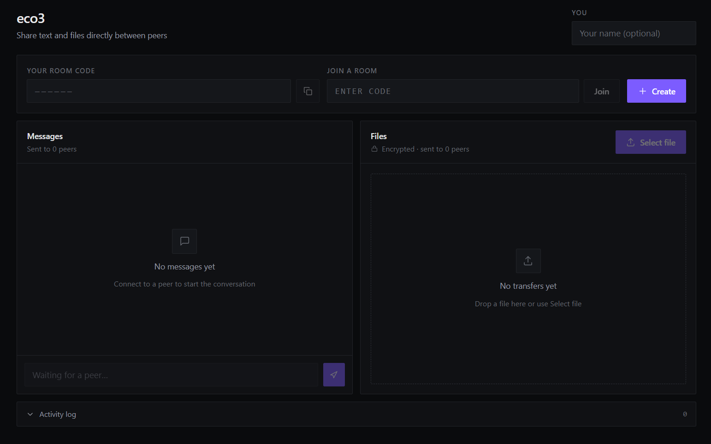

<div align="center">

# eco3

**Share text and files directly between browsers — no uploads, no accounts, no size limit.**

[](https://webrtc.org/)
[](https://react.dev/)
[](https://vite.dev/)
[](https://go.dev/)
[](#privacy)



</div>

---

## What is eco3?

eco3 is a peer-to-peer transfer app that runs entirely in your browser. Open it, create a
room, share the six-character code, and anyone who joins can exchange messages and files
with you directly.

The files never touch a server. They move over an encrypted connection straight from one
browser to the other, which means there's no upload wait, no storage quota, and no copy of
your data sitting in somebody else's datacentre. A 30 GB video moves the same way a 30 KB
text file does.

It's built for the moment you need to hand a large file to someone **right now** — a
colleague across the desk, your own laptop across the room, a friend across the world —
without email limits, cloud accounts, or a USB stick.

## Features

- 📡 **Direct transfers** — files stream browser-to-browser, never through a server
- ♾️ **No size limit** — files are written straight to disk as they arrive, not held in memory
- 👥 **Up to 4 people per room** — everyone connects to everyone, not through a host
- 🎯 **Pick your recipients** — send to the whole room, or select just the people you want
- ✋ **Accept before you receive** — nothing lands on your disk until you choose where to save it
- 🏷️ **Name yourself** — set an alias so people see `Arsh-af46` instead of `af46c1d2`
- 💬 **Live messaging** — a chat alongside the transfers, over the same connection
- 🔒 **Encrypted by default** — every connection is DTLS-encrypted end to end
- 🌑 **Clean dark interface** — one screen, no menus, nothing to configure

## How it works

**1. Create a room** — you get a six-character code like `K7M2QX`. Ambiguous characters
(`I`, `O`, `0`, `1`) are left out, so it's safe to read aloud over a call.

**2. Share the code** — up to three other people enter it and join. Everyone appears in the
peer list as they connect.

**3. Send** — drop a file or type a message. By default it goes to everyone in the room;
click peers in the list to narrow it down.

**4. Receive** — an incoming file waits for you to press **Accept**, then asks where to save
it. It streams to that location as it arrives, and completed media files get an **Open**
button.

Rooms are temporary. When the last person leaves, the room disappears.

## Browser support

Sending files and messaging work in **every modern browser**. Receiving files needs the
[File System Access API](https://developer.mozilla.org/en-US/docs/Web/API/File_System_API),
which is currently Chromium-only.

| Browser | Send files | Receive files | Messaging |
| :--- | :---: | :---: | :---: |
| Chrome, Edge, Brave, Arc, Opera | ✅ | ✅ | ✅ |
| Firefox | ✅ | ❌ | ✅ |
| Safari | ✅ | ❌ | ✅ |

> **Note**
> eco3 detects this on load. In Firefox or Safari you'll see a banner explaining the
> limitation, and the **Accept** button is disabled — everything else keeps working, so you
> can still send a large file to someone on Chrome.

This is a deliberate trade-off. Writing directly to disk is what removes the size ceiling;
the usual fallback buffers the whole file in memory first, which caps transfers at a couple
of gigabytes and risks crashing the tab.

**Also required:** WebRTC data channels, available in all of the above.

## Privacy

- Files and messages travel **directly between browsers**, encrypted with DTLS
- The server only helps two browsers find each other — it never sees file contents
- Nothing is stored anywhere; close the tab and it's gone
- No accounts, no sign-in, no tracking

Peers on restrictive networks may not be able to reach each other directly, since eco3 uses
a public STUN server and no relay fallback.

## Running it locally

You'll need [Go](https://go.dev/) and [Node.js](https://nodejs.org/).

```bash
# signalling server — http://localhost:8080
cd server
go run ./api

# web app — http://localhost:5173
cd frontend/eco3
npm install
npm run dev
```

Open the app in two browser windows, create a room in one, and join with the code in the
other.

| Variable | Default | What it does |
| :--- | :--- | :--- |
| `PORT` | `8080` | Port for the signalling server |
| `CORS_ORIGINS` | `http://localhost:5173`, `http://127.0.0.1:5173` | Comma-separated origins allowed to reach the API |

## Limits

- **4 people per room** — beyond that, the number of direct connections each browser has to
  maintain starts to hurt
- **One file at a time** per sender
- **Rooms are not persistent** — codes are not reusable once everyone leaves
- **No relay fallback** — a symmetric NAT or strict corporate firewall on both ends can
  block the direct connection
